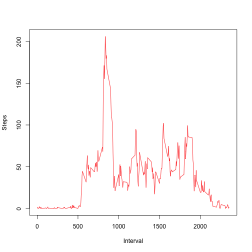
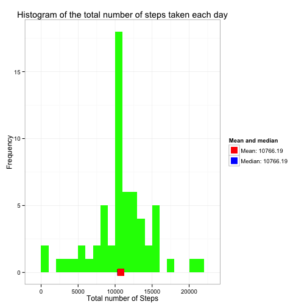
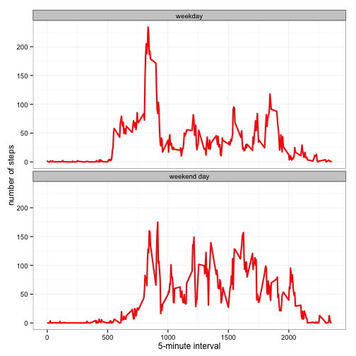

# Reproducible Research: Peer Assessment 1
========================================================

It is now possible to collect a large amount of data about personal movement using activity monitoring devices such as a **Fitbit**, **Nike Fuelband**, or **Jawbone Up**. These type of devices are part of the “quantified self” movement – a group of enthusiasts who take measurements about themselves regularly to improve their health, to find patterns in their behavior, or because they are tech geeks. But these data remain under-utilized both because the raw data are hard to obtain and there is a lack of statistical methods and software for processing and interpreting the data.

This assignment makes use of data from a personal activity monitoring device. This device collects data at 5 minute intervals through out the day. The data consists of two months of data from an anonymous individual collected during the months of October and November, 2012 and include the number of steps taken in 5 minute intervals each day.

# Data

The data for this assignment (Dataset: Activity monitoring data [52K]) can be downloaded from the course web site.

## Loading and preprocessing the data
The data can be downloaded using the following R script.

```r
downloadFile <- function(url = "https://d396qusza40orc.cloudfront.net/repdata%2Fdata%2Factivity.zip") {
    ## check if directory and file exist; if not, create directory, download and
    ## store data in data directory, else return feedback
    if (!file.exists("./data")) {
        dir.create("./data")
    }
    if (!file.exists("./data/activity.csv")) {
        temp <- tempfile()
        download.file(url, temp, method = "curl")
        unzip(temp, exdir = "./data/")
        unlink(temp)
        message("Downloaded and stored file.")
    } else {
        message("File already exists.")
    }
}
```


The variables included in this dataset are:
- **steps**: Number of steps taking in a 5-minute interval (missing values are coded as NA)
- **date**: The date on which the measurement was taken in YYYY-MM-DD format
- **interval**: Identifier for the 5-minute interval in which measurement was taken

The dataset is stored in a comma-separated-value (CSV) file and there are a total of 17,568 observations in this dataset. The file can be read using the following R script.


```r
## execute downloadFile function, read csv file, transform date into a format
## suitable for the analysis
fname = "./data/activity.csv"
if (!file.exists(fname)) downloadFile()
data <- read.csv("./data/activity.csv")
data$date <- as.Date(data$date, format = "%Y-%m-%d")
```


```r
## display basic statistics to get a visual feeling of the dataset
dim(data)
```

```
## [1] 17568     3
```

```r
summary(data)
```

```
##      steps            date               interval   
##  Min.   :  0.0   Min.   :2012-10-01   Min.   :   0  
##  1st Qu.:  0.0   1st Qu.:2012-10-16   1st Qu.: 589  
##  Median :  0.0   Median :2012-10-31   Median :1178  
##  Mean   : 37.4   Mean   :2012-10-31   Mean   :1178  
##  3rd Qu.: 12.0   3rd Qu.:2012-11-15   3rd Qu.:1766  
##  Max.   :806.0   Max.   :2012-11-30   Max.   :2355  
##  NA's   :2304
```

```r
head(data)
```

```
##   steps       date interval
## 1    NA 2012-10-01        0
## 2    NA 2012-10-01        5
## 3    NA 2012-10-01       10
## 4    NA 2012-10-01       15
## 5    NA 2012-10-01       20
## 6    NA 2012-10-01       25
```

```r
str(data)
```

```
## 'data.frame':	17568 obs. of  3 variables:
##  $ steps   : int  NA NA NA NA NA NA NA NA NA NA ...
##  $ date    : Date, format: "2012-10-01" "2012-10-01" ...
##  $ interval: int  0 5 10 15 20 25 30 35 40 45 ...
```


## What is the mean total number of steps taken per day?
This part of the assignement consitst of 2 tasks:

1. Make a histogram of the total number of steps taken each day: *see below* 
2. Calculate and report the mean and median total number of steps taken per day: *see the legend next to the plot* 

This can be achieved using the following R script.


```r
## User ggplot2
library(ggplot2)

## Set steps per day (aggregate steps by date), calculate mean and median
stepsPerDay <- aggregate(steps ~ date, data, sum)
colnames(stepsPerDay) <- c("date", "steps")
meanSteps <- round(mean(stepsPerDay$steps), 2)
medianSteps <- round(median(stepsPerDay$steps), 2)

## Display Mean and Median
col_labels <- c(paste("Mean:", meanSteps), paste("Median:", medianSteps))
cols <- c("red", "blue")

## Create plot
ggplot(stepsPerDay, aes(x = steps)) + geom_histogram(fill = "green", binwidth = 1000) + 
    geom_point(aes(x = meanSteps, y = 0, color = "red"), size = 5, shape = 15) + 
    geom_point(aes(x = medianSteps, y = 0, color = "blue"), size = 5, shape = 15) + 
    scale_color_manual(name = "Mean and median", labels = col_labels, values = cols) + 
    labs(title = "Histogram of the total number of steps taken each day", x = "Total number of Steps", 
        y = "Frequency") + theme_bw() + theme(legend.position = "right")
```

 


## What is the average daily activity pattern?
This part of the assignement consitst of 2 tasks:

- Make a time series plot (i.e. type = "l") of the 5-minute interval (x-axis) and the average number of steps taken, averaged across all days (y-axis): *see below* 

This can be achieved using the following R script.

```r
## Store means in temporary variable to display later on
tmp <- tapply(data$steps, data$interval, na.rm = T, mean)

## Create plot
dailyActivity <- aggregate(steps ~ interval, data, FUN = mean, na.rm = TRUE)
colnames(dailyActivity) <- c("Interval", "Steps")
plot(dailyActivity, type = "l", col = "red")
```

 


- Which 5-minute interval, on average across all the days in the dataset, contains the maximum number of steps? 

This can be achieved using the following R script.

```r
## Display interval with maximum number of steps
which.max(tmp)
```

```
## 835 
## 104
```


## Imputing missing values

Note that there are a number of days/intervals where there are missing values (coded as NA). The presence of missing days may introduce bias into some calculations or summaries of the data.

- Calculate and report the total number of missing values in the dataset (i.e. the total number of rows with NAs)


```r
## Display total number of missing values
data2 <- data
missing_indices <- which(is.na(data2$steps))
nMissing <- length(missing_indices)
nMissing
```

```
## [1] 2304
```

```r
stepsPerInterval <- aggregate(steps ~ interval, data2, FUN = mean, na.rm = TRUE)
dataMeans <- stepsPerInterval
```


- Devise a strategy for filling in all of the missing values in the dataset. The strategy does not need to be sophisticated. For example, you could use the mean/median for that day, or the mean for that 5-minute interval, etc.: *Replace the missing values with the mean values of each day, because it is likely that activities are the same per day*
- Create a new dataset that is equal to the original dataset but with the missing data filled in.


```r
# Loop through rows with missing values and determinge replacements
replacements <- unlist(lapply(missing_indices, FUN = function(index) {
    interval = data2[index, ]$interval
    dataMeans[dataMeans$interval == interval, ]$steps
}))

# Fill in replacements
tmp_steps <- data2$steps
tmp_steps[missing_indices] <- replacements
df <- data.frame(steps = tmp_steps, date = data2$date, interval = data2$interval)
summary(df)
```

```
##      steps            date               interval   
##  Min.   :  0.0   Min.   :2012-10-01   Min.   :   0  
##  1st Qu.:  0.0   1st Qu.:2012-10-16   1st Qu.: 589  
##  Median :  0.0   Median :2012-10-31   Median :1178  
##  Mean   : 37.4   Mean   :2012-10-31   Mean   :1178  
##  3rd Qu.: 27.0   3rd Qu.:2012-11-15   3rd Qu.:1766  
##  Max.   :806.0   Max.   :2012-11-30   Max.   :2355
```


4. Make a histogram of the total number of steps taken each day and Calculate and report the **mean** and **median** total number of steps taken per day. 

Do these values differ from the estimates from the first part of the assignment? *The mean is the same (since we input the mean into missing values). The median is equal to the mean.*


```r
## User ggplot2
library(ggplot2)

## Set steps per day (aggregate steps by date), calculate mean and median
stepsPerDay <- aggregate(steps ~ date, df, sum)
colnames(stepsPerDay) <- c("date", "steps")
meanSteps <- round(mean(stepsPerDay$steps), 2)
medianSteps <- round(median(stepsPerDay$steps), 2)

## Display Mean and Median
col_labels <- c(paste("Mean:", meanSteps), paste("Median:", medianSteps))
cols <- c("red", "blue")

## Create plot
ggplot(stepsPerDay, aes(x = steps)) + geom_histogram(fill = "green", binwidth = 1000) + 
    geom_point(aes(x = meanSteps, y = 0, color = "red"), size = 5, shape = 15) + 
    geom_point(aes(x = medianSteps, y = 0, color = "blue"), size = 5, shape = 15) + 
    scale_color_manual(name = "Mean and median", labels = col_labels, values = cols) + 
    labs(title = "Histogram of the total number of steps taken each day", x = "Total number of Steps", 
        y = "Frequency") + theme_bw() + theme(legend.position = "right")
```

 

What is the impact of imputing missing data on the estimates of the total daily number of steps? *Since we input the mean for missing values, the total of steps rises.*:

## Are there differences in activity patterns between weekdays and weekends?
This part of the assignement consitst of 2 tasks:
- Create a new factor variable in the dataset with two levels – “weekday” and “weekend” indicating whether a given date is a weekday or weekend day.
- Make a panel plot containing a time series plot (i.e. type = “l”) of the 5-minute interval (x-axis) and the average number of steps taken, averaged across all weekday days or weekend days (y-axis).

This can be achieved using the following R script.

```r
# Convert date to day of week (first set locale to English)
Sys.setlocale("LC_TIME", "C")
```

```
## [1] "C"
```

```r
data$weekendOrWeekday <- (weekdays(as.Date(data$date, "%Y-%m-%d")) %in% c("Saturday", 
    "Sunday"))

# Loop through rows and determine if the day is a weekend or weekday: if
# there is a value, the date is weekend
for (i in 1:nrow(data)) {
    if (data$weekendOrWeekday[i]) {
        data$weekendOrWeekday[i] <- "weekend day"
    } else {
        data$weekendOrWeekday[i] <- "weekday"
    }
}

# Convert variable to a factor
data$weekendOrWeekday <- factor(data$weekendOrWeekday)

# Assign values
compareWeekendOrWeekday <- aggregate(steps ~ interval + weekendOrWeekday, data, 
    FUN = mean, na.rm = TRUE)

# Create a panel plot
ggplot(compareWeekendOrWeekday, aes(x = interval, y = steps)) + geom_line(color = "red", 
    size = 1) + facet_wrap(~weekendOrWeekday, nrow = 2, ncol = 1) + labs(x = "5-minute interval", 
    y = "number of steps") + theme_bw()
```

 

